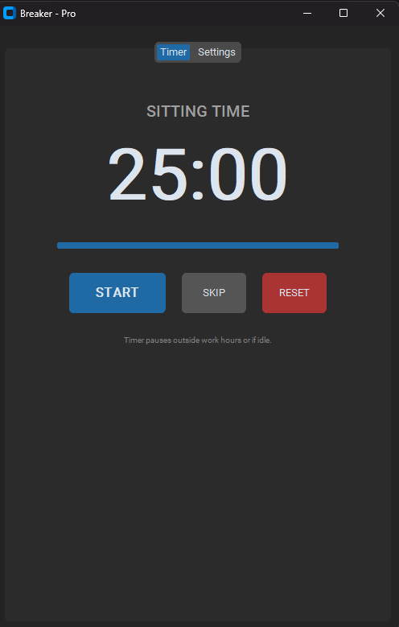

# Breaker Pro - Sit/Stand Timer

Breaker Pro is a modern, advanced timer application designed to help you maintain a healthy balance between sitting and standing while working. Built with Python and CustomTkinter, it features a sleek dark UI, customizable schedules, and strict enforcement modes.



## Features

- **Sit/Stand Cycles**: Customizable durations for sitting and standing.
- **Transition Mode**: A buffer period between cycles to prepare you for the change.
- **Strict Mode**: Optional screen overlay that blocks interaction during transition periods to ensure you take the break.
- **Flexible Schedules**: Define multiple work ranges (e.g., `08:00-12:00`, `20:00-02:00`). The timer pauses outside these hours.
- **Idle Detection**: Automatically resets the timer if you leave your computer for a set period.
- **System Tray Support**: Minimizes to the system tray to keep your taskbar clean.
- **Custom Sounds**: Choose your own `.mp3` or `.wav` file for notifications.
- **Transparency Control**: Adjust the opacity of the overlay window.

## Installation

### Option 1: Run form Executable (Windows)
1. Download the latest `Breaker.exe` from the [Releases](#) page.
2. Run `Breaker.exe`.
3. (Optional) Go to Settings -> Enable "Run on Startup".

### Option 2: Run from Source
1. Clone this repository:
   ```bash
   git clone https://github.com/harveyzoka/Breaker-Pro.git
   cd Breaker-Pro
   ```
2. Create a virtual environment and install dependencies:
   ```bash
   python -m venv venv
   .\venv\Scripts\activate
   pip install -r requirements.txt
   ```
3. Run the application:
   ```bash
   python main.py
   ```

## Usage

1. **Start/Pause**: Click the main button to start or pause the timer.
2. **Settings**:
   - Go to the **Settings** tab.
   - Adjust **Durations** (Sit, Stand, Transition).
   - Set your **Work Schedule** (one range per line).
   - Toggle **Strict Mode** if you want the screen blocking feature.
   - Select a **Sound File** for notifications.
   - Click **Save & Apply Settings**.
3. **Minimize**: Click the `X` button to minimize to the System Tray.
4. **Quit**: Right-click the System Tray icon and select `Quit`.

## Development

### Requirements
- Python 3.10+
- `customtkinter`
- `pystray`
- `pywin32`
- `playsound`
- `Pillow`

### Build Executable
To build a standalone `.exe` file:
```bash
pip install pyinstaller
pyinstaller --noconsole --onefile --name "Breaker" --collect-all customtkinter main.py
```
The output file will be in the `dist/` folder.

## License
MIT License

## Contributing
Contributions are welcome! Please feel free to submit a Pull Request.
